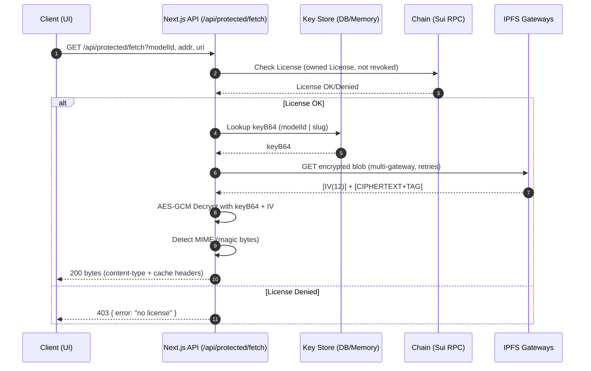

# MarketPlaceAI Web (v0.1.0)

Marketplace de modelos de IA en Sui con compra de licencias Perpetua y Suscripción, listado optimizado (infinite scroll), y carga de modelos con validaciones e IPFS.

## Stack

- Next.js 14 (App Router) + React + TypeScript
- Material UI (MUI)
- TanStack Query
- Sui (@mysten/dapp-kit, @mysten/sui.js)
- IPFS (Pinata u otros gateways)

## Features (v0.1.0)

- Home marketera con hero, beneficios, pasos, testimonios y CTA
- Explorar modelos:
  - Infinite scroll + “Cargar más”
  - Búsqueda por nombre/slug (debounce 300ms)
  - Orden y filtro “Solo listados” aplicados en backend
  - 12 ítems por página + skeletons
- Detalle/listado: compra de Perpetua y Suscripción (1–12 meses)
- Publicación de modelos con validaciones y nombres de archivo únicos en IPFS

## Instalación

```bash
npm i
cp .env.example .env.local
npm run dev
```

Abre http://localhost:3000

## Variables de entorno (.env.local)

Consulta `.env.example` y ajusta según tu entorno. Claves principales:

- NEXT_PUBLIC_MARKET_ID
- NEXT_PUBLIC_PACKAGE_ID
- NEXT_PUBLIC_SUI_RPC_URL
- NEXT_PUBLIC_PINATA_GATEWAY
- IPFS_GATEWAYS

## Scripts

- dev – desarrollo
- build – build producción
- start – server producción

## Notas de build

- Para cortar v0.1 se ignoran errores de ESLint en build (`next.config.mjs`).
- Algunas rutas API se marcan como dinámicas por uso de `request.url`.

## Roadmap

 - Arquitectura multi‑chain (Base/EVM) mediante adapters
 - Centro de notificaciones y mejoras de UX
 - Endurecer tipos y reactivar ESLint en CI

## Changelog

Ver `CHANGELOG.md`.

You can check out [the Next.js GitHub repository](https://github.com/vercel/next.js) - your feedback and contributions are welcome!

## Deploy on Vercel

The easiest way to deploy your Next.js app is to use the [Vercel Platform](https://vercel.com/new?utm_medium=default-template&filter=next.js&utm_source=create-next-app&utm_campaign=create-next-app-readme) from the creators of Next.js.

Check out our [Next.js deployment documentation](https://nextjs.org/docs/app/building-your-application/deploying) for more details.

## Dev server recovery playbook

- Si el server se traba o no arranca:
  - `npm run doctor:port` libera el puerto 3002.
  - `npm run clean` limpia `.next/.turbo` de forma segura.
  - `npm run dev:3002` o `npm run rebuild:dev` (clean + npm ci + dev).
- Recomendaciones:
  - Evitar matar el server durante “Compiling …”.
  - Ejecutar solo una instancia de `next dev` por proyecto.
  - Excluir `.next/` del antivirus/Spotlight si genera locks.

-
# Secure Protected Content (Quick Guide)

## Environment (.env.local)
- Required
  - `SUI_RPC_URL=https://fullnode.testnet.sui.io:443`
  - `NEXT_PUBLIC_PACKAGE_ID=<Move package id>`
  - `NEXT_PUBLIC_MARKET_ID=<Marketplace parent object id>`
  - `KEYS_BYPASS_ONCHAIN=true` (dev only)
- IPFS Gateways (primary + fallback)
  - `NEXT_PUBLIC_PINATA_GATEWAY=https://gateway.pinata.cloud`
  - `IPFS_GATEWAYS=https://gateway.pinata.cloud,https://ipfs.io,https://dweb.link`
- Network tuning
  - `IPFS_FETCH_TIMEOUT_MS=7000`
  - `IPFS_FETCH_RETRIES=2`

## API Endpoints
- Register key (server-only in-memory demo)
  - `POST /api/keys/put` body: `{ "modelId": 19, "slug": "MN8", "keyB64": "<base64>" }`
- Get key (bypass on-chain in dev)
  - `GET /api/keys/get?modelId=19&addr=<wallet>`
  - or `GET /api/keys/get?slug=<slug>&owner=<creator>&addr=<wallet>`
- Secure fetch (server decrypts, never exposes key)
  - `GET /api/protected/fetch?modelId=19&addr=<wallet>&uri=ipfs://<CID_ENC>`
  - Optional gateway override: `&gw=https://gateway.pinata.cloud`

## Postman Test Flow
1) Get model info: `GET /api/model-info?id=19` → copy `uri` (metadata CID)
2) Open metadata: `https://ipfs.io/ipfs/<CID_METADATA>` → copy `encrypted_uri`
3) Ensure key exists: `GET /api/keys/get?modelId=19&addr=<wallet>` (else do `POST /api/keys/put`)
4) Secure fetch: `GET /api/protected/fetch?modelId=19&addr=<wallet>&uri=ipfs://<CID_ENC>`
   - If a gateway fails, add `&gw=https://gateway.pinata.cloud`
5) Validate response headers
   - `content-type` should match (image/jpeg, image/png, application/pdf, etc.)
   - Save response to file and open with a native viewer

## Frontend Integration
- The page `app/models/[id]/page.tsx` fetches decrypted bytes from
  `GET /api/protected/fetch` and renders by type.
- No keys are sent to the client. Content type is inferred from the
  response header and magic bytes as a fallback.

## Notes
- In-memory key store is for development only. Use a database for staging/prod.
- For real on-chain checks, disable `KEYS_BYPASS_ONCHAIN`.

See also: [Testing Guide](./docs/TESTING.md) for quick cURL/Postman flows and Prometheus tips.

### Env quick reference (Retries, timeouts, and CSP)

- Server-side key lookup (in `/api/protected/fetch`):
  - `PROTECTED_KEY_LOOKUP_RETRIES` number of attempts to locate key by id/slug. Example: `6`.
  - `PROTECTED_KEY_LOOKUP_DELAY_MS` delay between attempts in ms. Example: `1200`.
- IPFS gateway fetch tuning (server):
  - `IPFS_FETCH_TIMEOUT_MS` per-attempt timeout in ms when downloading from gateways. Example: `8000`.
  - `IPFS_FETCH_RETRIES` attempts per gateway before moving to the next. Example: `3`.
- Client-side retries (model detail page):
  - `NEXT_PUBLIC_PROTECTED_FETCH_RETRIES` attempts on 404 before surfacing the error. Example: `3`.
  - `NEXT_PUBLIC_PROTECTED_FETCH_RETRY_DELAY_MS` delay between attempts in ms. Example: `1000`.
- Cache/profile (server response):
  - `PROTECTED_CACHE_PRIVATE`, `PROTECTED_CACHE_MAX_AGE`, `PROTECTED_CACHE_IMMUTABLE`, `PROTECTED_ENABLE_ETAG`, `PROTECTED_ENABLE_RANGE`.
- CSP for media playback from decrypted blobs:
  - `next.config.mjs` includes `media-src 'self' blob: https: data:` so `<video>`/`<audio>` with blob URLs work.

Tip: add these to `.env.local` and restart the dev server.

---

# Postman Tests (Detailed Flow)

## Prerequisites
- Server running locally, e.g. `npm run dev -p 3002`
- `.env.local` includes:
  - `NEXT_PUBLIC_PACKAGE_ID=...`
  - `NEXT_PUBLIC_MARKET_ID=...`
  - `SUI_RPC_URL=https://fullnode.testnet.sui.io:443`
  - `NEXT_PUBLIC_PINATA_GATEWAY=https://gateway.pinata.cloud`
  - `IPFS_GATEWAYS=https://gateway.pinata.cloud,https://ipfs.io,https://dweb.link`
  - `IPFS_FETCH_TIMEOUT_MS=7000`
  - `IPFS_FETCH_RETRIES=2`
  - `DATABASE_URL=postgresql://<user>@localhost:5432/marketplaceai?schema=public`
  - `KEYS_ADMIN_TOKEN=<your-token>` (for PUT)
  - Cache profile (staging/prod):
    - `PROTECTED_CACHE_PRIVATE=true`
    - `PROTECTED_CACHE_MAX_AGE=60`
    - `PROTECTED_CACHE_IMMUTABLE=false`
    - `PROTECTED_ENABLE_ETAG=true`
    - `PROTECTED_ENABLE_RANGE=true`

## 1) Get model metadata and encrypted_uri
- GET `http://localhost:3002/api/model-info?id=19`
- Copy `uri` from response and open `https://ipfs.io/ipfs/<CID_METADATA>`
- Copy `encrypted_uri` (e.g., `ipfs://Qm...`)

## 2) Put key (DB) [Requires token]
- POST `http://localhost:3002/api/keys/put`
- Headers:
  - `content-type: application/json`
  - `authorization: Bearer <KEYS_ADMIN_TOKEN>` (or `x-admin-token: <KEYS_ADMIN_TOKEN>`)
- Body:
  ```json
  { "modelId": 19, "slug": "MN8", "keyB64": "<base64>" }
  ```
- Expect: `200 { "ok": true }`

## 3) Get key
- GET `http://localhost:3002/api/keys/get?modelId=19&addr=<wallet>`
- Expect: `200 { "keyB64": "..." }`

## 4) Secure fetch (server-side decryption)
- GET `http://localhost:3002/api/protected/fetch?modelId=19&addr=<wallet>&uri=ipfs://<CID_ENC>`
- Optional: `&gw=https://gateway.pinata.cloud`
- Validate headers:
  - `content-type`: image/jpeg | image/png | application/pdf | etc.
  - `cache-control`: according to env
  - `accept-ranges: bytes`
  - `etag: W/"<hash>"` (if enabled)
- Save response to disk and open with native viewer.

## 5) ETag validation (304)
- Precondition: `PROTECTED_ENABLE_ETAG=true`
- Step A: Perform step 4 and copy `etag` header value.
- Step B: Repeat step 4 with header `If-None-Match: W/"<copied-hash>"`
- Expect: `304 Not Modified` and empty body.

## 6) HTTP Range (partial content)
- Precondition: `PROTECTED_ENABLE_RANGE=true`
- GET same URL as step 4 with header `Range: bytes=0-1023`
- Expect:
  - `206 Partial Content`
  - `content-range: bytes 0-1023/<TOTAL_BYTES>`
  - `content-length: 1024`
- Repeat with another valid range: `Range: bytes=1024-2047`

## 7) Negative cases
- Gateway failure: invalid `uri` → `502 { error: "fetch-enc-failed" }`
- No license (disable bypass): `KEYS_BYPASS_ONCHAIN=false` → `403 { error: "no license" }`
- Key not found: skip step 2 → `404 { error: "not found" }`

---

# Security Model (Protected Files)

## Overview
Protected assets are stored encrypted on IPFS and only decrypted server-side after verifying access rights. The decryption key is never exposed to the client.

## Components
- Encryption: AES‑GCM 256
  - Layout: `[IV(12 bytes)] [CIPHERTEXT+TAG]`
  - IV is prepended to the blob when uploading.
- Key storage:
  - Development: in-memory map for quick bootstrap.
  - Production: Postgres table `model_keys` via Prisma (`ModelKey`), keyed by `modelId` (and optional `slug`).
  - API:
    - `POST /api/keys/put` (protegido con `KEYS_ADMIN_TOKEN`) para registrar claves.
    - `GET /api/keys/get` valida licencia y devuelve la clave solo en entornos dev cuando `KEYS_BYPASS_ONCHAIN=true`.
- License checks:
  - En `GET /api/protected/fetch` se valida la licencia on‑chain (o `bypass` en dev) antes de descifrar.

## Server-side Decryption Flow
1. Cliente llama `GET /api/protected/fetch?modelId=<id>&addr=<wallet>&uri=ipfs://<CID_ENC>`.
2. El servidor resuelve/valida `modelId` y verifica licencia del `addr`.
3. Obtiene la `keyB64` de memoria o Postgres.
4. Descarga el contenido cifrado desde IPFS usando gateways con fallback y timeouts.
5. Separa `IV` (primeros 12 bytes) y `ciphertext`.
6. Descifra con AES‑GCM usando la clave almacenada.
7. Detecta MIME por magic bytes y responde con los bytes descifrados y `content-type` correcto.

## Why server-side?
- Evita exponer la clave en el navegador o bundles.
- Permite validar licencia y aplicar políticas (caché, rate limiting, logging) antes de servir.
- Facilita observabilidad y auditoría (Prometheus/Otel).

## Cache & Transport
- Headers configurables por `.env.local`:
  - `PROTECTED_CACHE_PRIVATE`, `PROTECTED_CACHE_MAX_AGE`, `PROTECTED_CACHE_IMMUTABLE`
  - `PROTECTED_ENABLE_ETAG` (If-None-Match → 304)
  - `PROTECTED_ENABLE_RANGE` (descargas parciales 206)
- Recomendado: `private, max-age=60`, ETag y Range habilitados. Evitar caches compartidas.

## Operational Notes
- Rotación de claves: soportada a nivel de DB; los contenidos subidos deben cifrarse con la nueva clave.
- Si una clave no coincide, AES-GCM fallará (tag inválido) y el servidor devolverá 500/502 según el caso.
- Gateways IPFS configurables (`NEXT_PUBLIC_PINATA_GATEWAY`, `IPFS_GATEWAYS`) con retry y timeout.

## Diagrama (Mermaid)


